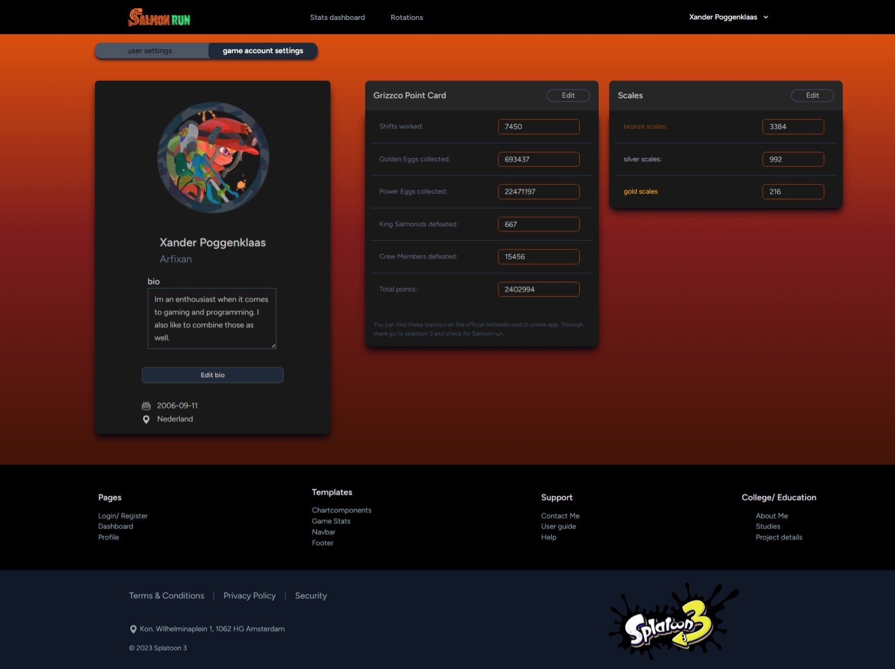

# Salmon run stats tracker app

[]()
[](https://www.python.org/downloads/)
[](https://www.pygame.org/news)
[](https://legacy.reactjs.org/docs/getting-started.html)
[]()

This is a project i build for one of my most played and favourite game of 2023.
Its about the side mode in splatoon 3 called Salmon run.

```bash
    git clone https://github.com/Xander172006/track-app.git
```
<br />

## About this project

<center align="left">
    
    <div style="width: 450px" align="left">
        <p>
            Salmon run is a zombie type survival mode based on team strategizing and objectives.
            The mode can get increasingly harder the higher you end up and can be played for an endless amount.
        </p>
        <p>
            My goal was to make a tracking app to tack all of the bosses, badges and achievements that nintendo
            does not give to the player in game. I spent 3 weeks on building a user interface with a dashboard that analysis the data.
            In my project i also builded a self made api to track this and make relations with the database models.
        </p>
    </div>
</center>

<br />

## Installation

The following libraries are required to run the application:
- [Composer](https://getcomposer.org/doc/) for managing dependencies
- [Laravel](https://laravel.com/) for the backend and API
- [npm](https://www.npmjs.com/) for managing frontend dependencies
- [React](https://react.dev/) for the frontend and user interface
<br />

### a. Composer
Install [`Composer`](https://getcomposer.org/doc/) using the following command:
```bash
    composer install
```

### b. npm
Install [`npm`](https://www.npmjs.com/) using the following command:
```bash
    npm install
```
<br />


## Usage
### Creating the interactive dashboard
Make sure you are in the correct directory and run the following command to migrate the database as well as seed the database with the necessary data:
```bash
    cd path/to/track-app
    php artisan migrate
    php artisan db:seed
```

Once the connection is stable and you have registered or created an account you can use view the dashboard as wel as the upcoming rotations.
<br />

<div style="display: flex; gap: 20px;">
    
    
</div>

<br />

## Implementation & Customization

[](./docs/images/game_stats_image.jpeg)
<br />

You can customize your ingame stats as well as the badges you have to replicate your real game stats as perfectly as can be.
There is a settings page for personal account, and game account using a generated UUID to track the data.

If there are points or details that are missing, then feel free to contact me on my email or on my github page.


## Contributors


[](Xander172006)

**Location:** Bit Academy, Amsterdam
</br>
**Email:** xanderpoggenklaas@gmail.com
</br>
**Twitter:** [@XPoggenklaas](https://twitter.com/XPoggenklaas)